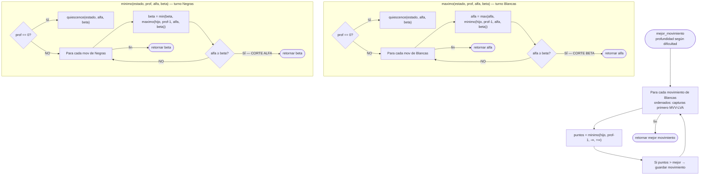
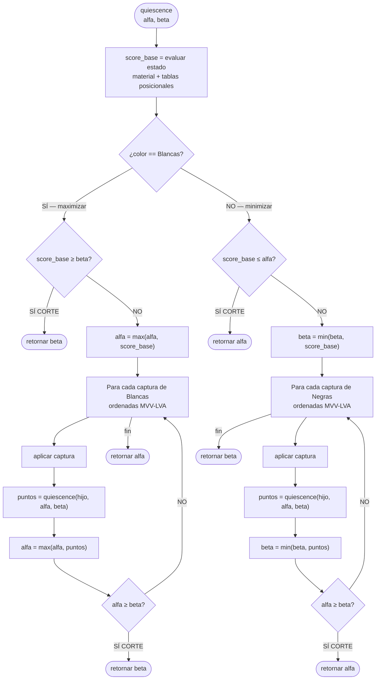
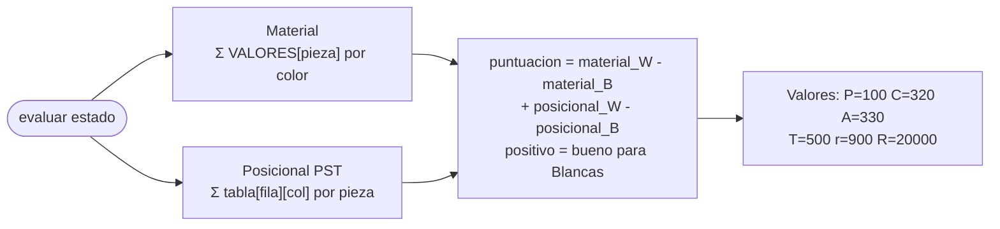
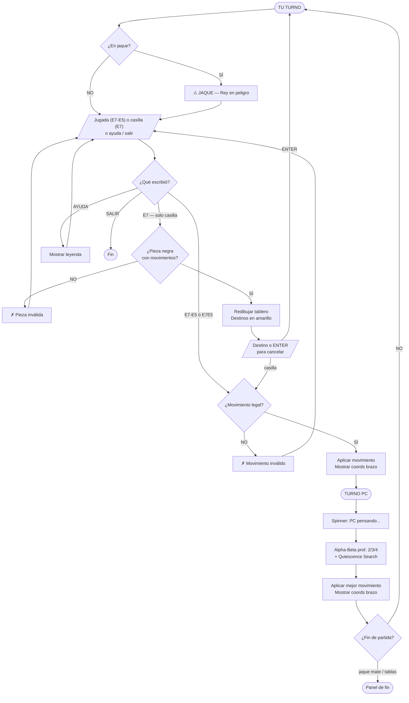

# AJEDREZ TERMINAL v1.0

Juego de ajedrez en consola integrado al proyecto del brazo robótico.
Inspirado en **The Chessmaster — Game Boy (1989)**.

## Cómo ejecutar

```bash
python main.py
```

---

## Piezas y notación (letras en español)

| Símbolo | Pieza   | Color distinguido por          |
|---------|---------|--------------------------------|
| `R`     | Rey     | ANSI: blanco brillante / cyan  |
| `r`     | Reina   | ANSI: blanco brillante / cyan  |
| `T`     | Torre   | ANSI: blanco brillante / cyan  |
| `A`     | Alfil   | ANSI: blanco brillante / cyan  |
| `C`     | Caballo | ANSI: blanco brillante / cyan  |
| `P`     | Peón    | ANSI: blanco brillante / cyan  |

- **Blancas (PC):** texto `bold bright_white`
- **Negras (Tú):** texto `bold bright_cyan`
- El color del fondo de casilla (claro/oscuro) da contexto adicional

### Colores del tablero

| Color de fondo    | Significado             |
|-------------------|-------------------------|
| Gris claro        | Casilla clara (normal)  |
| Gris oscuro       | Casilla oscura (normal) |
| Verde             | Pieza seleccionada      |
| Amarillo/dorado   | Destino válido          |
| Rojo              | Rey en jaque            |

---

## Cómo jugar

### Flujo de turno (híbrido)

Tienes dos formas de mover:

**Opción 1 — Jugada directa:**
```
> E7-E5
```
Ejecuta el movimiento inmediatamente si es válido.

**Opción 2 — Ver opciones primero:**
```
> E7
```
El tablero se redibuja con los destinos válidos resaltados en amarillo.
Luego se pide el destino:
```
> Destino (ej: E5) o ENTER para cancelar: E5
```

### Comandos especiales

| Comando  | Acción                              |
|----------|-------------------------------------|
| `AYUDA`  | Muestra la leyenda de piezas        |
| `SALIR`  | Termina la partida                  |

### Dificultad

Al iniciar se elige el nivel, que mapea directamente a la **profundidad de búsqueda** de la IA:

| Nivel      | Profundidad | Nodos típicos analizados |
|------------|-------------|--------------------------|
| Fácil (1)  | 2           | ~800                     |
| Medio (2)  | 3           | ~2,000–4,000             |
| Difícil (3)| 4           | ~10,000–25,000           |

### Reglas soportadas

- Movimientos completos de todas las piezas
- Enroque corto y largo (con validación de jaque al paso)
- Captura al paso (*en passant*)
- Promoción de peón (se pregunta la pieza)
- Jaque, jaque mate, ahogado
- Material insuficiente
- Regla de los 50 movimientos

---

## Arquitectura del algoritmo IA

### Evolución histórica

```
1950 ──► Shannon — Minimax puro
           Explora todo el árbol. O(b^d). Demasiado lento.

1956 ──► McCarthy/Newell — Alpha-Beta Pruning
           Poda ramas que no pueden mejorar el resultado.
           Misma calidad, hasta 10× más rápido.

1975      Knuth & Moore formalizan la teoría de Alpha-Beta.

1970s ──► Negamax
           Simplificación de código de Alpha-Beta.
           Una sola función en vez de dos (maximo/minimo).
           Mismo resultado matemático.

1978 ──► Sargon (Kathe & Dan Spracklen)
           Primer programa de ajedrez comercial.
           Usaba Alpha-Beta en Z80 a 4MHz.

1989 ──► The Chessmaster — Game Boy
           Alpha-Beta + Quiescence Search.
           Hardware: Sharp LR35902 ~4MHz, 8KB RAM.
           ← Nuestro modelo de referencia

1980s ──► Iterative Deepening Alpha-Beta
           Busca prof 1, luego 2, luego 3...
           Ordena mejor los movimientos en cada nivel.

1990s ──► Bitboards + Null Move Heuristic
           Representación ultra-rápida en 64 bits.
           Poda agresiva con movimiento nulo.

2006+ ──► Monte Carlo Tree Search (MCTS)
           Partidas aleatorias para estimar valor.
           Base de AlphaGo/AlphaZero.
```

### Por qué Alpha-Beta puro (y no Negamax ni MCTS)

- **Alpha-Beta puro** (dos funciones `maximo`/`minimo`) es más legible que Negamax para fines educativos
- El resultado del juego es **idéntico** a Negamax — solo cambia la forma de escribirlo
- MCTS requiere redes neuronales para ser efectivo en ajedrez
- Bitboards son una optimización de C/ensamblador que pierde ventaja en Python

---

### Diagrama: Alpha-Beta puro



---

### Diagrama: Quiescence Search

Evita el **efecto horizonte**: ver una captura ganadora en el movimiento 3 sin ver que el oponente responde en el movimiento 4.



---

### Por qué Alpha-Beta supera al Minimax puro

| Algoritmo                        | Nodos analizados (prof. 3, ~35 mov/pos) |
|----------------------------------|----------------------------------------|
| Minimax puro                     | 35³ = **42,875**                       |
| Alpha-Beta sin ordenar           | ~15,000                                |
| Alpha-Beta + MVV-LVA (típico)    | ~2,000–4,000                           |
| Alpha-Beta óptimo teórico        | √(35³) ≈ **207**                       |

El **ordenamiento MVV-LVA** (Most Valuable Victim / Least Valuable Attacker) pone las capturas de mayor valor primero, acercando el caso típico al óptimo.

---

### Función de evaluación



**Piece-Square Tables (PST):** matrices 8×8 con bonus/penalidad según posición:
- Peón: bonus por avance y control del centro
- Caballo: bonus en casillas centrales, penalidad en bordes
- Alfil: bonus en diagonales largas
- Torre: bonus en columnas abiertas y 7ª fila
- Reina: leve preferencia central
- Rey: penaliza exposición en el centro, premia el enroque

Para Blancas: `PST[(7-fila)*8 + col]`
Para Negras: `PST[fila*8 + col]` (espejado verticalmente)

---

### Flujo UX completo



---

## Integración con el brazo robótico

Después de cada movimiento (tanto del jugador como de la PC), el sistema muestra las coordenadas físicas en centímetros para el brazo robótico:

```
Brazo: E7(12.0,18.0)cm → E5(12.0,12.0)cm
```

Esto usa la clase `Tablero` y la constante `DIAMETRO_CASILLA` ya existentes en el proyecto:

```python
from brazo_robotico.tablero import Tablero
from brazo_robotico.config import DIAMETRO_CASILLA

tablero_robot = Tablero(tamaño_casilla=DIAMETRO_CASILLA)
coord = tablero_robot.casilla_a_xy('E7')
# → Coordenada(x=12.0, y=18.0)
```

El sistema de coordenadas:
- `A1` → `(0.0, 0.0)` cm
- `H8` → `(21.0, 21.0)` cm (con `DIAMETRO_CASILLA = 3.0`)
- Eje X: columnas A→H
- Eje Y: filas 1→8
