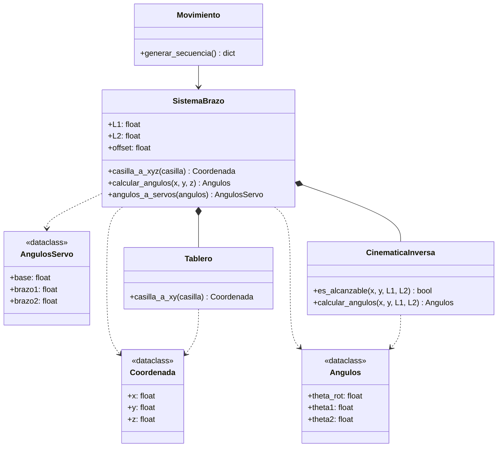
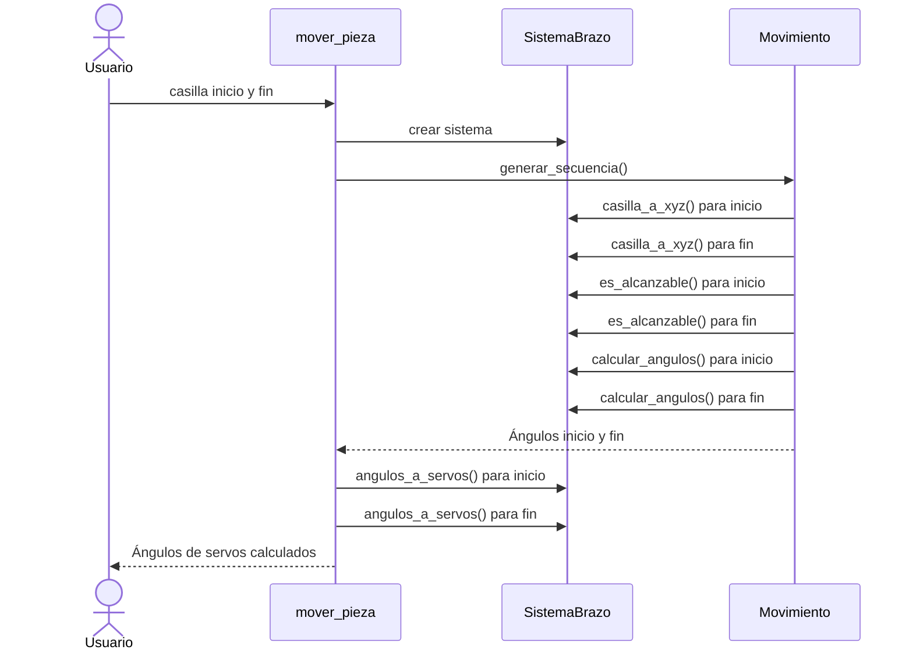
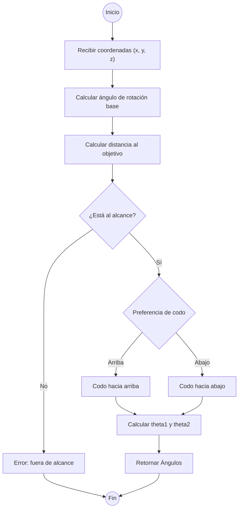
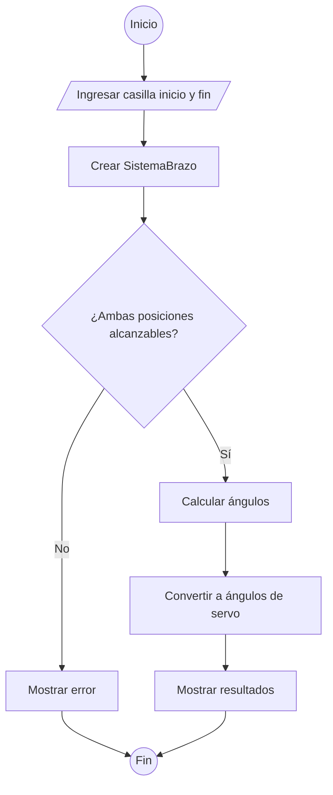

# Diagramas del Proyecto Brazo Robótico Ajedrez

## 1. Diagrama de Clases

### Explicación

El sistema se compone de 4 clases principales y 3 dataclasses que sirven como estructuras de datos:

- **Coordenada, Angulos, AngulosServo**: Son contenedores de datos simples. Coordenada guarda una posición (x, y, z), Angulos guarda los tres ángulos matemáticos del brazo, y AngulosServo guarda los ángulos ya convertidos para enviar a los servomotores físicos.
- **Tablero**: Representa el tablero de ajedrez. Su método `casilla_a_xy` convierte una notación como "A5" a coordenadas en centímetros.
- **CinematicaInversa**: Contiene la lógica matemática. Dado un punto en el espacio, calcula si el brazo puede llegar (`es_alcanzable`) y qué ángulos necesita para llegar (`calcular_angulos`).
- **SistemaBrazo**: Es la clase central que integra todo. Contiene al Tablero y a la CinematicaInversa, y expone métodos simplificados que coordinan ambos.
- **Movimiento**: Orquesta un movimiento completo de una casilla a otra, usando SistemaBrazo internamente.

Las líneas sólidas con rombo (`*--`) indican composición: SistemaBrazo crea y contiene a Tablero y CinematicaInversa. La flecha sólida (`-->`) indica que Movimiento usa a SistemaBrazo. Las flechas punteadas (`..>`) indican dependencia: las clases usan esos dataclasses como parámetros o valores de retorno.

---

## 2. Diagrama de Secuencia

### Explicación

El diagrama muestra el orden en que se ejecutan las operaciones cuando el usuario quiere mover una pieza:

1. El usuario ingresa dos casillas (por ejemplo, A5 y G2).
2. `mover_pieza` crea el sistema del brazo y le pide a Movimiento que genere la secuencia.
3. Dentro de `generar_secuencia()`, Movimiento necesita hacer lo mismo para ambas casillas (inicio y fin): primero convierte cada casilla a coordenadas XYZ, luego verifica que el brazo pueda alcanzar cada posición, y finalmente calcula los ángulos necesarios para cada una.
4. Al terminar, `mover_pieza` recibe los ángulos matemáticos y los convierte a ángulos de servo (los valores que se envían directamente a los motores), uno por cada posición.
5. Se muestran los resultados al usuario.

---

## 3. Diagrama de Actividades: Cinemática Inversa

### Explicación

Este diagrama detalla cómo funciona el cálculo de cinemática inversa, es decir, cómo el sistema determina los ángulos del brazo para llegar a un punto:

1. Se reciben las coordenadas (x, y, z) del punto destino en centímetros.
2. Se calcula el ángulo de rotación de la base: hacia qué dirección debe girar el brazo para apuntar al objetivo (usando la posición lateral x y frontal y).
3. Se calcula la distancia total desde la base hasta el punto objetivo.
4. Se verifica si esa distancia está dentro del alcance del brazo (entre |L1-L2| y L1+L2 cm). Si el punto está muy lejos o muy cerca, el brazo no puede llegar y se genera un error.
5. Si es alcanzable, se elige la configuración del codo: "arriba" significa que el codo se eleva por encima de la línea del brazo, "abajo" lo contrario. Esto importa porque para un mismo punto destino existen dos posiciones posibles del brazo.
6. Finalmente se calculan theta1 (ángulo del hombro) y theta2 (ángulo del codo) usando la ley de cosenos, y se retornan los tres ángulos.

---

## 4. Diagrama de Actividades: Flujo General

### Explicación

Este diagrama muestra el flujo completo del programa de forma simplificada:

1. El usuario ingresa la casilla de origen y la casilla de destino de la pieza que quiere mover.
2. Se crea el SistemaBrazo, que internamente configura el tablero y el motor de cinemática.
3. Se valida que el brazo pueda alcanzar ambas posiciones. Si alguna está fuera del rango físico del brazo, se muestra un error y termina.
4. Si ambas son alcanzables, se calculan los ángulos matemáticos (rotación base, hombro y codo) para cada posición.
5. Esos ángulos se convierten a ángulos de servo, que son los valores reales (0° a 180°) que se enviarían a los motores del brazo.
6. Se muestran los resultados al usuario en tablas.
