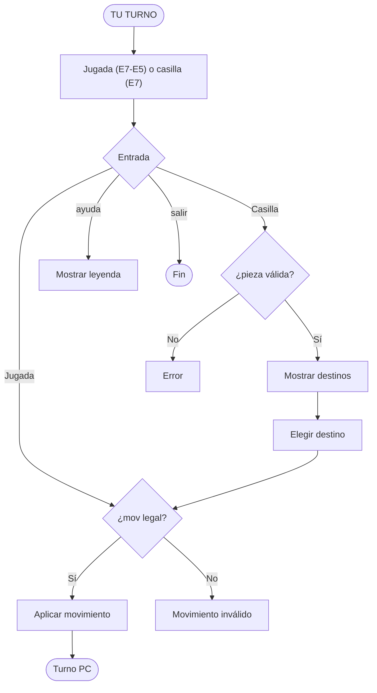
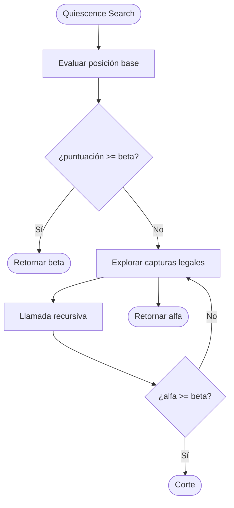

# Ajedrez Terminal v1.0 (Del Game Boy a la Robótica)

## 1. El origen de una duda: De dónde venimos

Desde hace muchos años, siempre tuve una pregunta que no lograba resolver: ¿cómo era posible que una consola como la Game Boy, con recursos tan limitados, pudiera ejecutar juegos de ajedrez como *The Chessmaster* y además jugar a un nivel competitivo?

La respuesta no estaba en una “inteligencia artificial moderna”, sino en la eficiencia de algoritmos clásicos. El descubrimiento del algoritmo Minimax junto con la poda Alpha-Beta marcó un punto clave en la comprensión del problema. Estos métodos permiten explorar árboles de decisión complejos de forma optimizada, descartando ramas irrelevantes y reduciendo significativamente el costo computacional.

Este proyecto representa la materialización de ese entendimiento. No solo se trata de replicar un motor de ajedrez, sino de llevar esa lógica al mundo físico mediante un sistema robótico capaz de ejecutar movimientos reales sobre un tablero.

---

## 2. Presentación del Programa

El sistema se ejecuta en una interfaz de consola enriquecida usando **rich**, diseñada para ofrecer una experiencia clara y eficiente sin depender de gráficos pesados.

### Representación de piezas

| Pieza   | Símbolo | Motivo                |
| ------- | ------- | --------------------- |
| Rey     | R       | Rey                   |
| Reina   | r       | Diferenciación visual |
| Torre   | T       | Torre                 |
| Alfil   | A       | Alfil                 |
| Caballo | C       | Caballo               |
| Peón    | P       | Peón                  |

### Esquema visual

* Blancas (PC): **bold white**
* Negras (usuario): **bold cyan**
* Casilla clara: grey82
* Casilla oscura: grey37
* Selección: green
* Movimientos válidos: yellow3
* Jaque: red

### Layout del tablero

```
     A   B   C   D   E   F   G   H
   ┌───┬───┬───┬───┬───┬───┬───┬───┐
 8 │ T │ C │ A │ r │ R │ A │ C │ T │
   ├───┼───┼───┼───┼───┼───┼───┼───┤
 7 │ P │ P │ P │ P │ P │ P │ P │ P │
   ├───┼───┼───┼───┼───┼───┼───┼───┤
 6 │   │   │   │   │   │   │   │   │
   ├───┼───┼───┼───┼───┼───┼───┼───┤
 5 │   │   │   │   │   │   │   │   │
   ├───┼───┼───┼───┼───┼───┼───┼───┤
 4 │   │   │   │   │   │   │   │   │
   ├───┼───┼───┼───┼───┼───┼───┼───┤
 3 │   │   │   │   │   │   │   │   │
   ├───┼───┼───┼───┼───┼───┼───┼───┤
 2 │ P │ P │ P │ P │ P │ P │ P │ P │
   ├───┼───┼───┼───┼───┼───┼───┼───┤
 1 │ T │ C │ A │ r │ R │ A │ C │ T │
   └───┴───┴───┴───┴───┴───┴───┴───┘
```

---

## 3. Flujo de Experiencia de Usuario (UX)

El sistema implementa un flujo híbrido (modo asistido + jugada directa).

### Diagrama de flujo UX



---

## 4. Arquitectura del Sistema

### Dataclasses principales

```python
@dataclass
class Pieza:
    tipo: str
    color: str
    movida: bool = False

@dataclass
class Movimiento:
    desde: tuple[int, int]
    hasta: tuple[int, int]

@dataclass
class EstadoJuego:
    tablero: list[list]
    turno: str
```

---

## 5. Motor de IA — Alpha-Beta

### Concepto

* Blancas = MAX
* Negras = MIN
* Evaluación en hojas

### Diagrama Alpha-Beta

```mermaid
flowchart TD
    START([Inicio de búsqueda]) --> LOOP[Iterar movimientos de Blancas]
    LOOP --> CALL[Llamar a minimo()]
    CALL --> BEST[Actualizar mejor valor]
    BEST --> LOOP
    LOOP --> RET([Retornar mejor movimiento])
```

### Subprocesos

```
maximo -> evalúa mejores jugadas
minimo -> evalúa peores jugadas
poda -> corta ramas irrelevantes
```

---

## 6. Quiescence Search

### Diagrama



---

## 7. Función de Evaluación

```
puntuacion = material + posicion
```

Valores:

* Peón: 100
* Caballo: 320
* Alfil: 330
* Torre: 500
* Reina: 900
* Rey: 20000

Incluye Piece-Square Tables para mejorar posicionamiento.

---

## 8. Integración con Brazo Robótico

Cada movimiento se traduce a coordenadas físicas.

Ejemplo:

* E7 → E5
* (12.0, 18.0) → (12.0, 12.0)

Esto permite ejecutar movimientos en el mundo real.

---

## 9. Conclusión

El proyecto integra:

* IA clásica
* Motor de juego
* UX en consola
* Robótica

Representa la evolución de un concepto clásico hacia una implementación física moderna.
